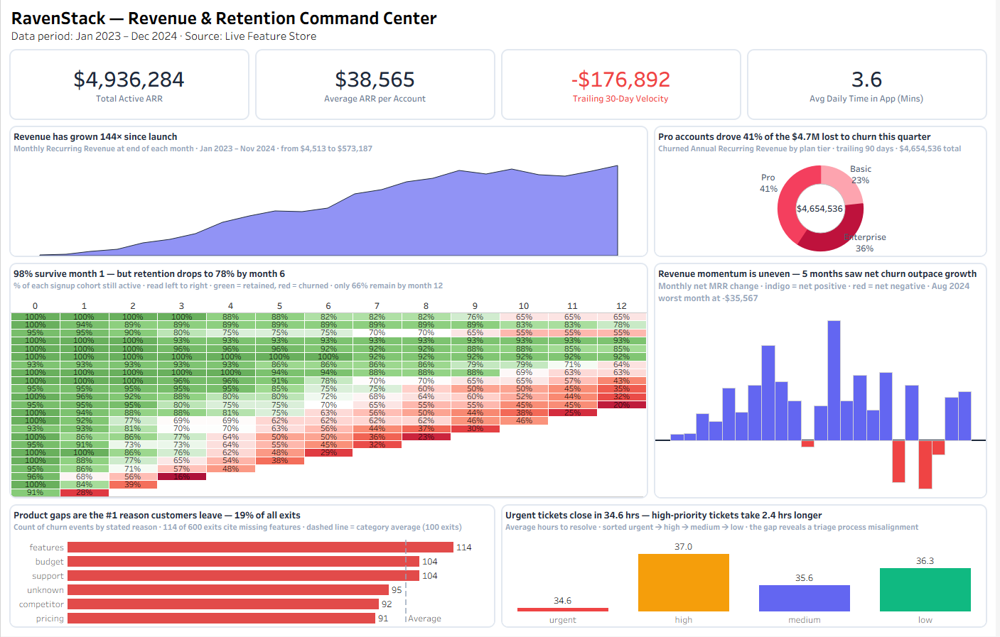
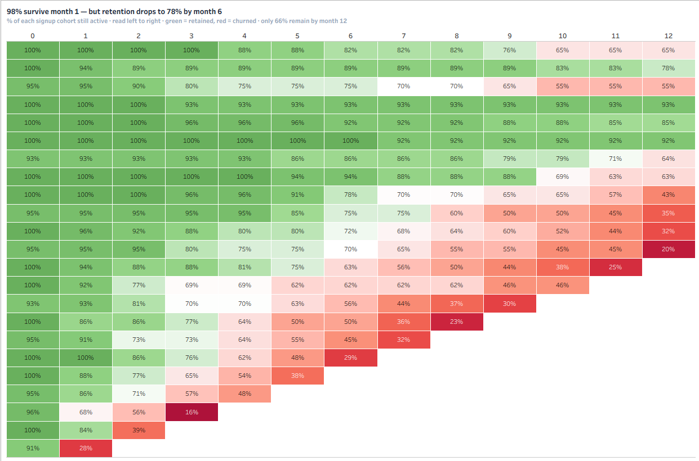
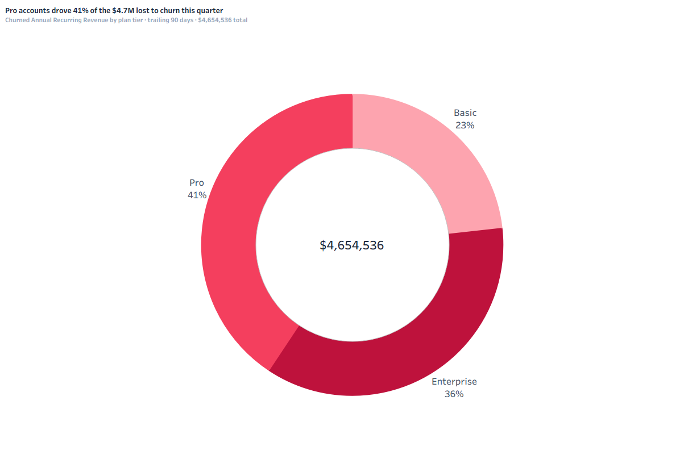
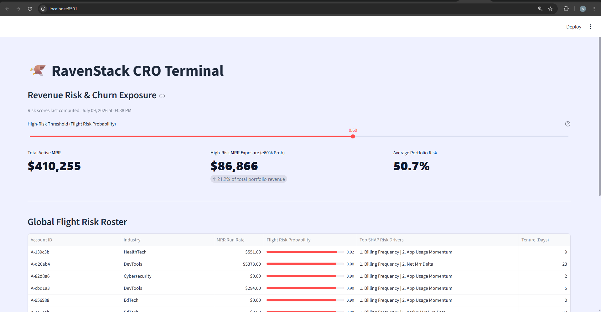

# RavenStack — Customer Retention Risk Engine

A subscription business loses customers every month. The question that decides whether a company survives that is simple: do you find out *before* the customer cancels, or *after*?

This project builds the "before." It takes raw, messy SaaS data — signups, billing events, product usage, support tickets, and cancellations — and turns it into two things a real company would actually use: a live executive dashboard that shows where revenue is healthy and where it's leaking, and a machine learning tool that flags which customers are about to leave, weeks before they do.

It's built end to end, the way a data team would actually build it: a SQL database that cleans and assembles the data, a Tableau dashboard for leadership, and a Python model with a simple web app for the Customer Success team to use day to day.

---

## What this project actually shows

Three things, in order of how a business would care about them:

**Where is the money, and is it growing or shrinking?**
Monthly recurring revenue grew 144× over two years — but the growth wasn't smooth. Five separate months saw more revenue lost to cancellations than gained from new and expanding customers, and the most recent month was the worst of all, with $176,892 in net losses driven by 96 cancellations.

**Who is leaving, and why?**
Customers on the Pro plan account for 41% of all revenue lost to cancellations — more than Enterprise and Basic combined. When customers do leave, the single biggest reason they give is missing product features, named in 19% of every exit.

**Can we predict who leaves next, before they do?**
Yes. A machine learning model trained on each account's billing history, product usage, and support activity assigns every active customer a real-time "flight risk" score, along with the two specific factors driving that risk — so a Customer Success rep doesn't just know *that* an account might leave, but *why*.

---

## See it in action

### The executive dashboard
A single view a CEO or VP of Sales can read in under a minute — total revenue, this month's momentum, where customers are dropping off, and what's causing it.



### The cohort retention view, up close
This chart answers one question: of the customers who signed up in a given month, what percentage are still around 1, 6, or 12 months later? 98% of customers make it past their first month — but by month six, only 78% remain.



### Where revenue is actually being lost


### The Customer Success risk terminal
A simple internal tool: pick a customer, see their cancellation risk as a percentage, see the two specific reasons driving that risk, and get a clear next step.




---

## How it's built

The project moves through four stages, each one feeding the next:

```
Raw CSV files (signups, billing, usage, support, cancellations)
        │
        ▼
MySQL  →  cleans the data and builds one daily snapshot per customer,
          tracking their exact revenue, activity, and status every single day
        │
        ├──────────────────────────────┐
        ▼                              ▼
   Tableau dashboard          Python machine learning model
   for leadership              for Customer Success
                                       │
                                       ▼
                              Streamlit web app
                              (the risk terminal above)
```

The hardest part of this project wasn't any single tool — it was making sure a customer's situation on any given day was represented *correctly*. A customer who churns shouldn't just disappear from the data; the SQL layer has to record the exact day their revenue dropped to zero, or every chart built on top of it tells a falsely optimistic story. Getting that right is most of what separates this from a beginner project.

### Tools used

| Layer | Tool | What it's doing |
|---|---|---|
| Database | MySQL 8.0 | Cleans five raw tables and builds a single daily revenue/activity snapshot per customer using a recursive calendar, deduplication logic, and window functions |
| Dashboard | Tableau Desktop | Turns that daily snapshot into the executive dashboard above |
| Machine learning | Python, LightGBM | Trains a model to predict which active customers are likely to cancel next |
| Explainability | SHAP | Translates the model's prediction into the two plain-English reasons behind each risk score |
| Survival analysis | Lifelines (Kaplan-Meier) | Estimates how long a typical customer sticks around, used to calculate each account's retention odds |
| Web app | Streamlit | The simple internal tool a Customer Success rep would actually open every morning |

### A few choices worth calling out

The model is trained and tested on **separate time periods** — older customers train it, newer customers test it — instead of randomly shuffling all customers together. This matters because randomly shuffling lets the model accidentally "see the future," which makes it look more accurate than it would actually be in production. Splitting by time is how this would really be evaluated at a company, and it's a deliberately harder, more honest test.

When evaluating whether a customer will churn, the model is only ever shown data from **before** the day they cancelled — never the cancellation day itself, and never anything after. This sounds obvious, but it's the single most common mistake in churn modeling: accidentally letting the model peek at information it wouldn't have access to in real life, which makes results look great in testing and fail in production.

---

## Repository structure

```
ravenstack-churn-risk-engine/
│
├── data/              All source CSVs and the generated daily feature dataset
├── sql/               The full MySQL script: table creation, data loading, and the view that powers everything downstream
├── notebooks/          The Python notebook: feature engineering, model training, and scoring
├── app/               The Streamlit web app and its saved model files
├── dashboard/          The Tableau workbook
├── assets/            Dashboard and app screenshots used in this README
├── requirements.txt    Python dependencies
└── .gitignore
```

---

## Running it yourself

```bash
# 1. Clone the repo
git clone https://github.com/your-username/ravenstack-churn-risk-engine.git
cd ravenstack-churn-risk-engine

# 2. Set up the Python environment
python -m venv venv
source venv/bin/activate          # Windows: venv\Scripts\activate
pip install -r requirements.txt

# 3. Build the database
#    Run sql/ravenstack_pipeline.sql in MySQL Workbench (or the CLI)

# 4. Add your database credentials
#    Create a .env file in the project root:
#    DB_USER=your_user
#    DB_PASS=your_password
#    DB_HOST=localhost
#    DB_NAME=ravenstack_raw

# 5. Run the notebook
#    Open notebooks/risk_engine.ipynb and run all cells —
#    this trains the model and generates the live scoring file

# 6. Launch the app
cd app
streamlit run app.py
```

---

## About the data

This project uses the [RavenStack synthetic SaaS dataset](https://rivalytics.medium.com) created by River @ Rivalytics — 500 simulated customer accounts across two years of signups, billing, product usage, support tickets, and cancellations. The data is fully synthetic; no real companies or people are represented. Credit to the original dataset author per its usage terms.

---

*Built as a portfolio project to demonstrate the full path from raw transactional data to a decision-ready business tool — the same path a data team would walk at a real subscription company.*
